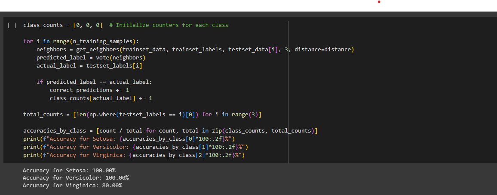

# Iris-Analysis---Python

## Introduction
This project is about the Iris species dataset. In this analysis, we implemented a K-nearest neighbors (KNN) classification model for the Iris dataset, a common use case in machine learning. The model utilized multiple attributes of Iris flowers to classify them into three species: Setosa, Versicolor, and Virginica. Our evaluation focused on assessing the overall accuracy of the model and its accuracy for each Iris species.

---

The output "Overall Accuracy: 91.67%" indicates that the K-nearest neighbors (KNN) model you applied to classify the Iris dataset achieved an overall accuracy of 91.67%. This means that, when the model was tested on a set of Iris flower samples, it correctly classified approximately 91.67% of them. In other words, out of all the Iris flowers in your test dataset, the KNN model correctly predicted the species (setosa, versicolor, or virginica) for roughly 91.67% of them. This accuracy percentage is a measure of how well the model performs in classifying the flowers, with a higher percentage indicating better performance.

The result above represents the accuracy of the K-nearest neighbors (KNN) model for classifying each type of Iris flower in the dataset individually. Here's the interpretation:

Accuracy for Setosa: 100.00%:
This indicates that the KNN model achieved a perfect accuracy of 100% when classifying Iris flowers of the "Setosa" species. In other words, every Iris flower in the test dataset that belongs to the "Setosa" class was correctly classified by the model.

Accuracy for Versicolor: 100.00%:
Similarly to the Setosa, this accuracy of 100% means that the KNN model correctly classified all Iris flowers of the "Versicolor" species in the test dataset.

Accuracy for Virginica: 80.00%:
Out of all the Iris flowers in the test dataset that belong to the "Virginica" class, the model correctly classified 80% of them.

The KNN model achieved perfect accuracy for the "Setosa" and "Versicolor" classes, but it had a slightly lower accuracy of 80% for the "Virginica" class. 

#### Would you classify the model as a good model or not?
Yes, the model can be classified as a good model, especially considering its high accuracy for the "Setosa" and "Versicolor" classes and an overall accuracy of 91.67%.

## Conclusion

The KNN model demonstrated strong performance, with an impressive overall accuracy of 91.67%. Notably, it achieved perfect accuracy for Setosa and Versicolor species and an 80% accuracy for Virginica. These results suggest that the KNN model is well-suited for the Iris dataset and can reliably distinguish between Setosa and Versicolor, while also performing reasonably well for Virginica. Depending on the specific requirements of the application, this model can be considered highly effective for Iris flower classification. [Connect here to see the code](IrisspeciesAnalysiscode.ipynb)
